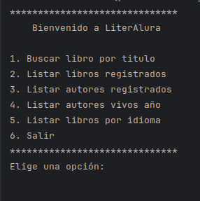
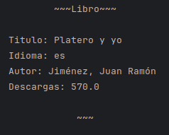
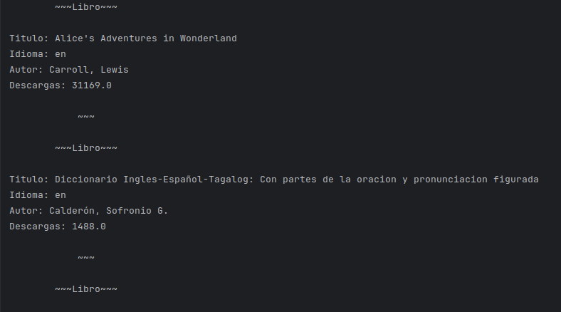
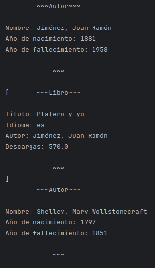
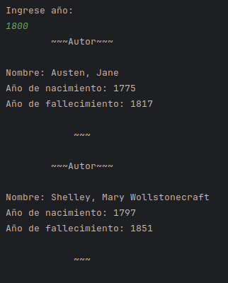
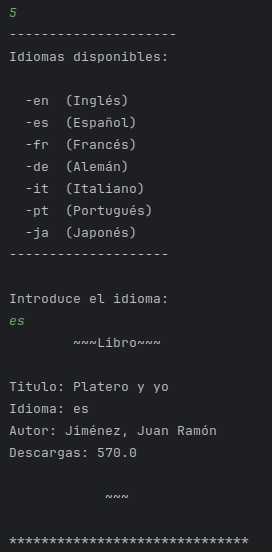

# Challenge-Literalura
Reto Oracle/Alura Back-end

## Objetivo: 

Desarrollar un Catálogo de Libros que ofrezca interacción textual (vía consola) con los usuarios, proporcionando al menos 5 opciones de interacción. Los libros se buscarán a través de la API [Gutendex](https://gutendex.com) la cual es una JSON web API del projecto Gutenberg.

## Tecnologias utilizadas

- Java JDK: versión: 17 en adelante 

- Maven: versión 4 en adelante

- Spring: versión 3.2.3 - https://start.spring.io/

- Postgres: versión 16 en adelante - 

- IDE (Entorno de desenvolvimento integrado) IntelliJ IDEA- opcional -

Configuración al crear el proyecto en Spring Initializr:

- Java (versión 17 en adelante)

- Maven (Initializr utiliza la versión 4)

- Spring Boot (versión 3.2.3)

- Proyecto en JAR

Dependencias para agregar al crear el proyecto en Spring Initializr:

- Spring Data JPA

- Postgres Driver

## Cómo probar esta API

Modificar el archivo: [application.properties](./literalura/src/main/resources/application.properties) reemplazando las varibles DB_NAME, DB_USER, DB_PASSWORD por el nombre de una base de datos creada, el nombre de usuario y contraseña respectivamente o declarado las variables de entorno de su sistema operativo, luego ejecutar el archivo LiteraluraApplication.java.

## Funcionalidad

### Menú Principal:

1. **Buscar libro por titulo:** 
Busca un libro en la API, si no esta registrado en la base de datos, lo guarda; sino informa que el libro ya se encuentra registrado. En ambos casos imprime la información del libro

2. **Listar libro registrados**
Lista los libros guardados en la base de datos en orden lexicográfico en caso de haber, caso contrario imprime: "No se encontraron libros registrados"

3. **Listar autores registrados**
Lista los autores registrados en orden lexicográfico en la base de datos, en caso de no haber autores registrados, imprime: "No se encontraron autores registrados".

4. **Listar autores vivos año**
Lista los autores vivos según el año que el usuario ingrese.

5. **Listar libros por idioma**
Lista los libros por el idioma que el usuario ingrese. Se ofrece al usuario un menú con las opciones a ingresar. 

6. **Salir**
Sale del programa

## Decisiones de diseño

Para este reto en particular se tomaron una series de decisiones para facilitar la realización del proyecto:

- Se toma el primer libro encontrado en la busqueda.
- Al testear la API se descubrió que habia libros que no tenian autor y además que coincidía con el primer primer libro encontrado. Para ese caso, se tomó la desición de tomar el primer libro encontrado que tuviera autor.

## EXTRAS

- **Generando estadísticas** (Opción 7): Obtiene el promedio de descargas, el total de descargas de: el libro más descargado y el libro menos descargado, y el total de libros en la base de datos.  

- **Top 10 libros más descargados** (Opción 8): Consulta los 10 libros más descargados en la base de datos.

- **Buscar autor por nombre** (Opción 9): Devuelve el autor buscado, si encuentra mas de una coincidencia, devuelve una lista de autores en la que el usuario deberá elegir el indicado.

**Listar autores con otras consultas**: mejora futura... 
